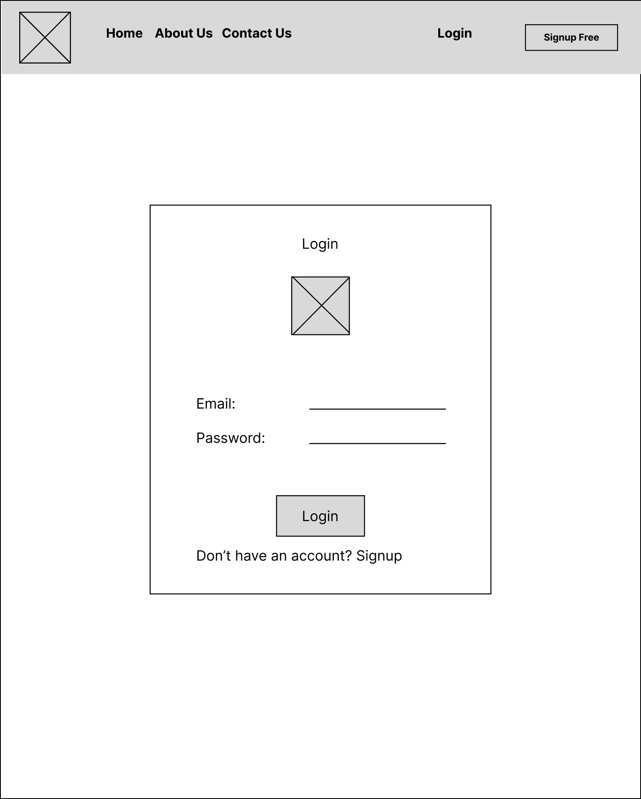
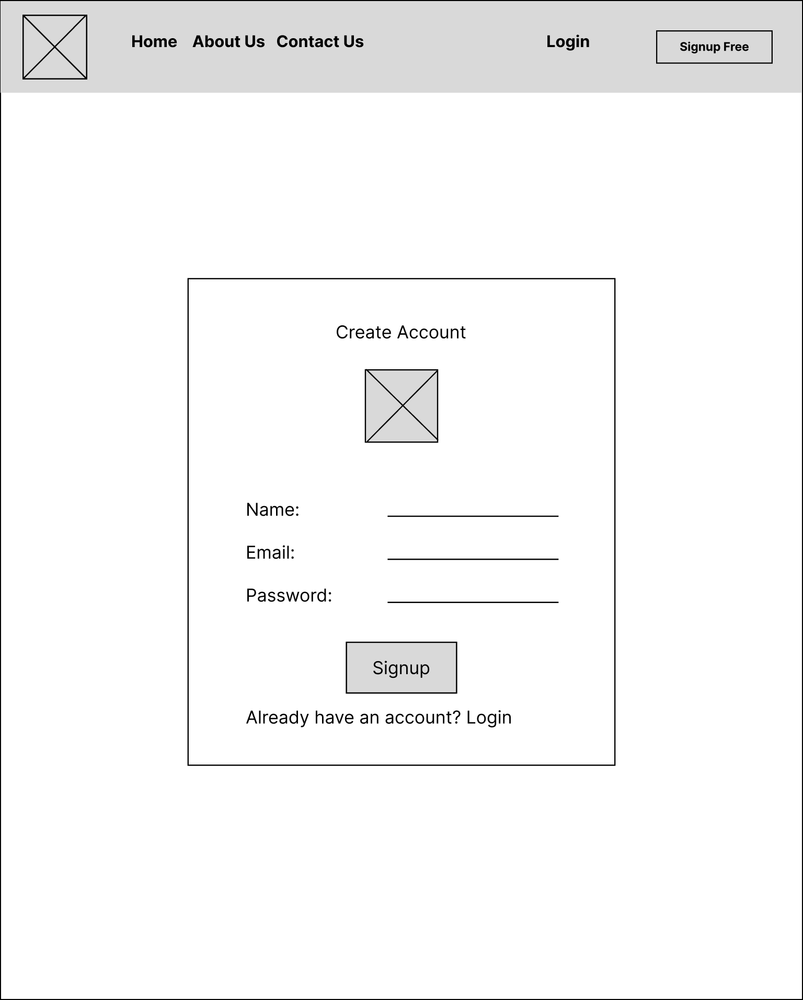
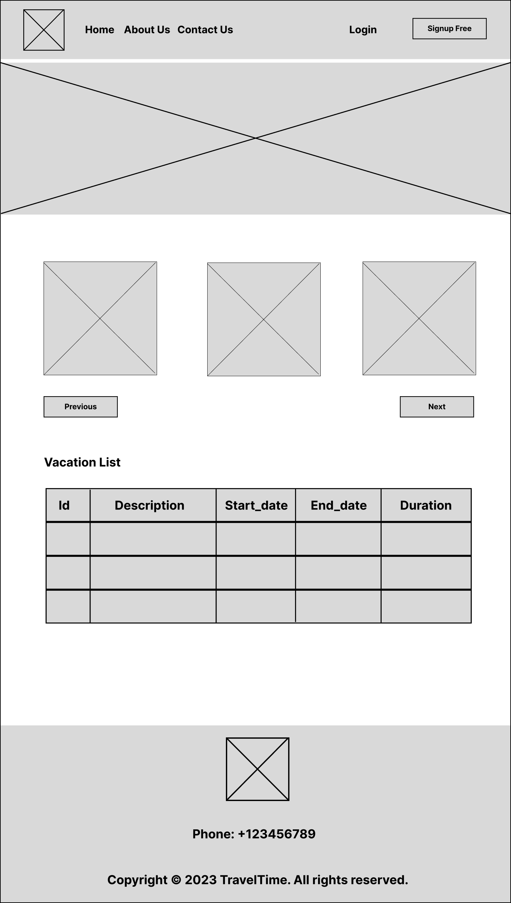
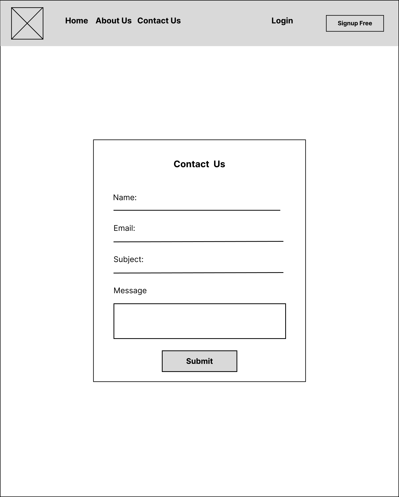

<br><br>

<!-- project philosophy -->


> A web app: Employee Vacation: each employee login into the app to manage their vacation. .
>
> Travel Time, an app made to simplifying employee vacation management. As every employee deserves a hassle-free and enjoyable vacation experience.This web application provides the tools and features necessary for employees to plan and manage their vacations effortlessly.

### User Stories
- As a user, I want to create an account, so that I can access the platform's features and become a part of the community.

- As a returning user, I want to be able to log in to my account, so that I can access my profile and use the platform's features.

- As a user, I want to see the list of vacations, so that i have a variety of options

- As a user (employee), I want to be able to add a vacation, so that I can specify a suitable time for me.

- As a user, I want to be able to edit a vacation, so that i can handle any change in my schedule and choose new timing for my vacation.

<br><br>

<!-- Prototyping -->


> Time Travel is designed using wireframes, iterating on the design until we reached the ideal layout for easy navigation and a seamless user experience.

### Wireframes
| Login screen  | Register screen |  Landing screen | About Us
| ---| ---| ---|
|  |  |  |   |

| Add Vacation  | Edit Vacation | Contact Us |
| ---| ---| ---|
|  |  |  |

<br><br>

<!-- Implementation -->


> Using the wireframes as a guide, Time Travel web app is implemented with the following features:


### User Screens (web)
| Login screen  | Register screen 
| ---| ---| 
|  |  |
| Homepage screen | AboutUs screen |
 |  |
| Add vacation | ContactUs Screen 
|  | 

<br><br>

<!-- Tech stack -->


###  Travel Time is built using the following technologies:

- This project uses ReactJS for the frontend. ReactJS is a popular JavaScript library for building user interfaces.
- In terms of design, Travel Time follows a simple and modern design with a focus on usability and user experience. The application uses a minimalist color palette with a clean and easy-to-use interface.
- Asp.net Mvc is used for the backend

<br><br>

<!-- How to run -->


> To set up Travel Time locally, follow these steps:

### Prerequisites

This is an example of how to list things you need to use the software and how to install them.
* npm
  ```sh
  npm install npm@latest -g
  ```

### Installation

### Prerequisites

This is an example of how to list things you need to use the software and how to install them.
* npm
  ```sh
  npm install npm@latest -g
  ```

### Installation

_Below is an example of how you can instruct your audience on installing and setting up your app. This template doesn't rely on any external dependencies or services._

1. Clone the project repository
   ```sh
   git clone https://github.com/rimaabouchacra/VacationApp.git
   ```
3. For React Install NPM packages
   ```sh
   cd VacationApp/vacation-app-frontend
   npm install
   ```

4. Start the server for React:

   ```sh
   npm start
   
   ```   
5. Start the server for .net:

    ```sh
   cd VacationApp/vacation-app-server
   dotnet run
   ```

Now, you should be able to run Travel Time locally and explore its features.